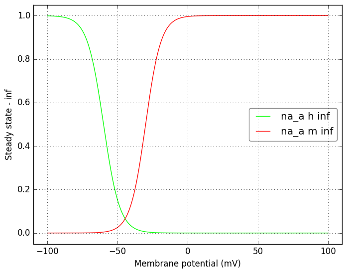
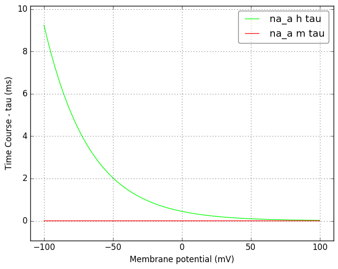
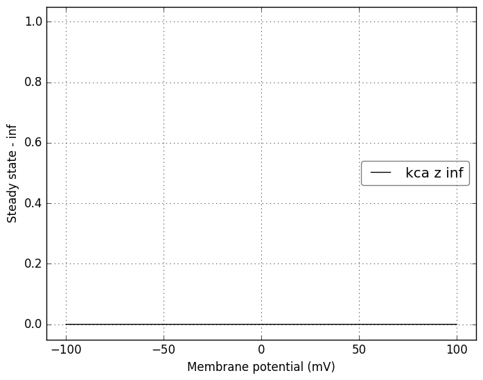
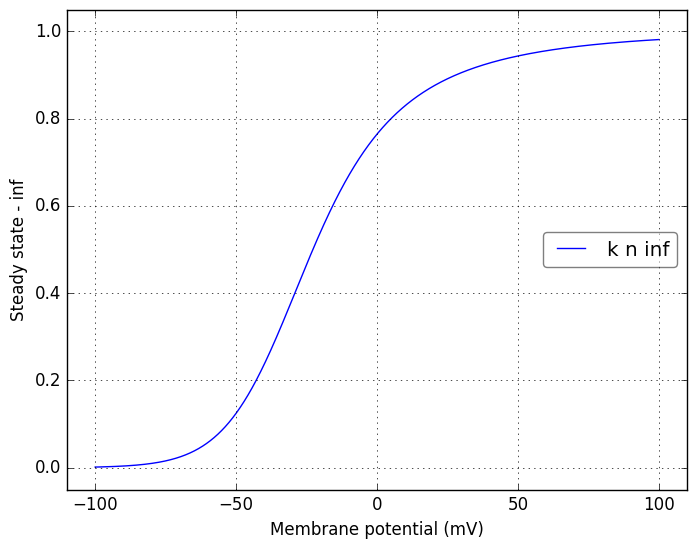
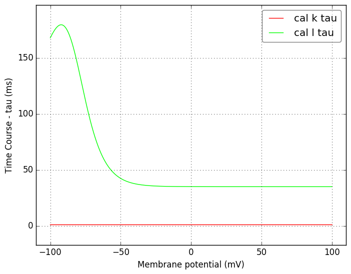
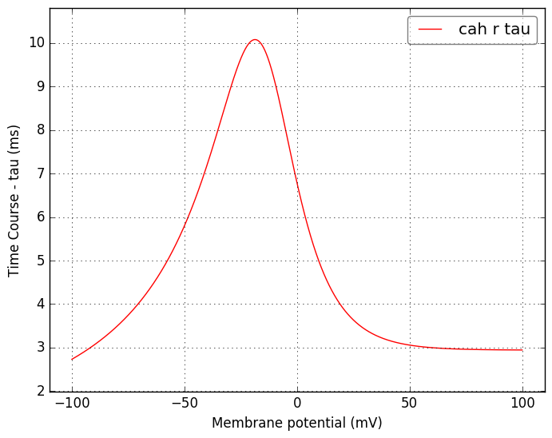
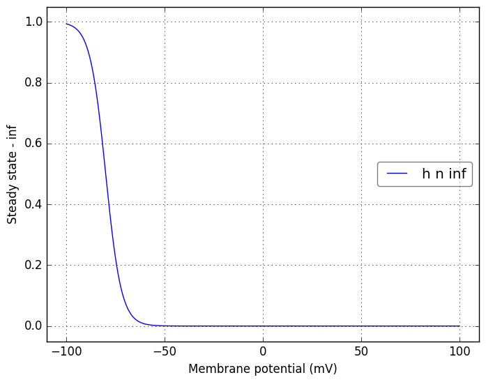
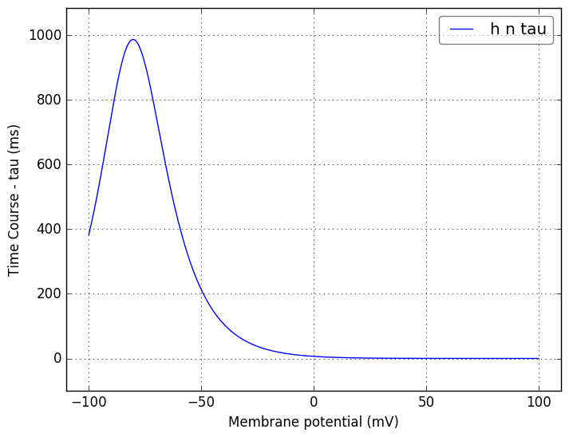

Channel information
===================
    

Channel information at: T = 6.3 degC, E_rev = 0 mV, [Ca2+] = 5e-05 mM

<table>
    <tr>
<td width="120px">
            <b>na_a</b> 
            <a href="../na_a.channel.nml">na_a.channel.nml</a> 
            <b>Ion: na</b> 
            <i>g = gmax * h * m3 </i> 
            ${channel.notes}
</td>
<td>

</td>
<td>

</td>
</tr>
    <tr>
<td width="120px">
            <b>na_s</b> 
            <a href="../na_s.channel.nml">na_s.channel.nml</a> 
            <b>Ion: na</b> 
            <i>g = gmax * h * m3 </i> 
            ${channel.notes}
</td>
<td>

</td>
<td>

</td>
</tr>
    <tr>
<td width="120px">
            <b>kdr</b> 
            <a href="../kdr.channel.nml">kdr.channel.nml</a> 
            <b>Ion: k</b> 
            <i>g = gmax * n4 </i> 
            ${channel.notes}
</td>
<td>

</td>
<td>

</td>
</tr>
    <tr>
<td width="120px">
            <b>kca</b> 
            <a href="../kca.channel.nml">kca.channel.nml</a> 
            <b>Ion: k</b> 
            <i>g = gmax * z </i> 
            ${channel.notes}
</td>
<td>

</td>
<td>

</td>
</tr>
    <tr>
<td width="120px">
            <b>k</b> 
            <a href="../k.channel.nml">k.channel.nml</a> 
            <b>Ion: k</b> 
            <i>g = gmax * n4 </i> 
            ${channel.notes}
</td>
<td>

</td>
<td>

</td>
</tr>
    <tr>
<td width="120px">
            <b>cal</b> 
            <a href="../cal.channel.nml">cal.channel.nml</a> 
            <b>Ion: ca</b> 
            <i>g = gmax * k3 * l </i> 
            ${channel.notes}
</td>
<td>

</td>
<td>

</td>
</tr>
    <tr>
<td width="120px">
            <b>cah</b> 
            <a href="../cah.channel.nml">cah.channel.nml</a> 
            <b>Ion: ca</b> 
            <i>g = gmax * r2 </i> 
            ${channel.notes}
</td>
<td>

</td>
<td>

</td>
</tr>
    <tr>
<td width="120px">
            <b>h</b> 
            <a href="../h.channel.nml">h.channel.nml</a> 
            <b>Ion: h</b> 
            <i>g = gmax * n </i> 
            ${channel.notes}
</td>
<td>

</td>
<td>

</td>
</tr>
</table>

